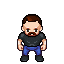

<!-- PROJECT LOGO -->
<br />
<div align="center">
  <a href="https://github.com/shane-smt/I_Merely_Spy">
    
  </a>

<h3 align="center">FTP_GAMEJAM_22-23</h3>

  <p align="center">
    GameJam Submission
    <br />
    <br />
    ·
    <a href="https://github.com/shane-smt/I_Merely_Spy/issues">Report Bug</a>
    ·
    <a href="https://github.com/shane-smt/I_Merely_Spy/issues">Request Feature</a>
  </p>
</div>


<!-- TABLE OF CONTENTS -->
<details>
  <summary>Table of Contents</summary>
  <ol>
    <li>
      <a href="#about-the-project">About The Project</a>
      <ul>
        <li><a href="#built-with">Built With</a></li>
      </ul>
    </li>
    <li>
      <a href="#getting-started">Getting Started</a>
      <ul>
        <li><a href="#prerequisites">Prerequisites</a></li>
        <li><a href="#installation">Installation</a></li>
      </ul>
    </li>
    <li><a href="#usage">Usage</a></li>
    <li><a href="#roadmap">Roadmap</a></li>
    <li><a href="#contributing">Contributing</a></li>
    <li><a href="#contact">Contact</a></li>
  </ol>
</details>


<!-- ABOUT THE PROJECT -->
## About The Project

My Entry for the first ever FTP GameJam 2022-2023 Xmas Period

FTP is where i work.

The Theme of the Jam was Take A Guess

<p align="right">(<a href="#readme-top">back to top</a>)</p>


### Built With

* [PyGame](https://www.pygame.org/)


<p align="right">(<a href="#readme-top">back to top</a>)</p>


<!-- GETTING STARTED -->
## Getting Started

To get a local copy up and running follow these simple example steps.

### Prerequisites

- Python3
- PyGame (see installation)

### Installation (I assume you are already in a virtual enviroment)

1. Install required modules
  ```sh
  pip install -r requirements.txt
  ```


<p align="right">(<a href="#readme-top">back to top</a>)</p>


<!-- USAGE EXAMPLES -->
### Usage

1. run main.py from code directory
  ```sh
  python3 main.py
  ```

<p align="right">(<a href="#readme-top">back to top</a>)</p>


<!-- ROADMAP -->
## Roadmap

- [X] Basic Movement
- [X] Basic collsions
- [ ] Player
    - [ ] Player Sprite Design
	- [ ] Player Sprite Animation
- [ ] NPC's
    - [X] NPC Sprite Design
	- [ ] NPC Sprite Animation
- [ ] Level Layout
- [ ] Player/NPC Interactions
- [ ] Dialog System
- [ ] Key Game Mechanic

See the [open issues](https://github.com/shane-smt/I_Merely_Spy/issues) for a full list of proposed features (and known issues).

<p align="right">(<a href="#readme-top">back to top</a>)</p>


<!-- CONTRIBUTING -->
## Contributing

If you have a suggestion that would make this better, please fork the repo and create a pull request. You can also simply open an issue with the tag "enhancement".
Don't forget to give the project a star! Thanks again!

1. Fork the Project
2. Create your Feature Branch (`git checkout -b feature/AmazingFeature`)
3. Commit your Changes (`git commit -m 'Add some AmazingFeature'`)
4. Push to the Branch (`git push origin feature/AmazingFeature`)
5. Open a Pull Request

<p align="right">(<a href="#readme-top">back to top</a>)</p>


<!-- CONTACT -->
## Contact

Project Link: [https://github.com/shane-smt/I_Merely_Spy](https://github.com/shane-smt/I_Merely_Spy)

<p align="right">(<a href="#readme-top">back to top</a>)</p>


<!-- MARKDOWN LINKS & IMAGES -->
<!-- https://www.markdownguide.org/basic-syntax/#reference-style-links -->
[contributors-shield]: https://img.shields.io/github/contributors/shane-smt/I_Merely_Spy.svg?style=for-the-badge
[contributors-url]: https://github.com/shane-smt/I_Merely_Spy/graphs/contributors
[forks-shield]: https://img.shields.io/github/forks/shane-smt/I_Merely_Spy.svg?style=for-the-badge
[forks-url]: https://github.com/shane-smt/I_Merely_Spy/network/members
[stars-shield]: https://img.shields.io/github/stars/shane-smt/I_Merely_Spy.svg?style=for-the-badge
[stars-url]: https://github.com/shane-smt/I_Merely_Spy/stargazers
[issues-shield]: https://img.shields.io/github/issues/shane-smt/I_Merely_Spy.svg?style=for-the-badge
[issues-url]: https://github.com/shane-smt/I_Merely_Spy/issues
[product-screenshot]: images/screenshot.png

